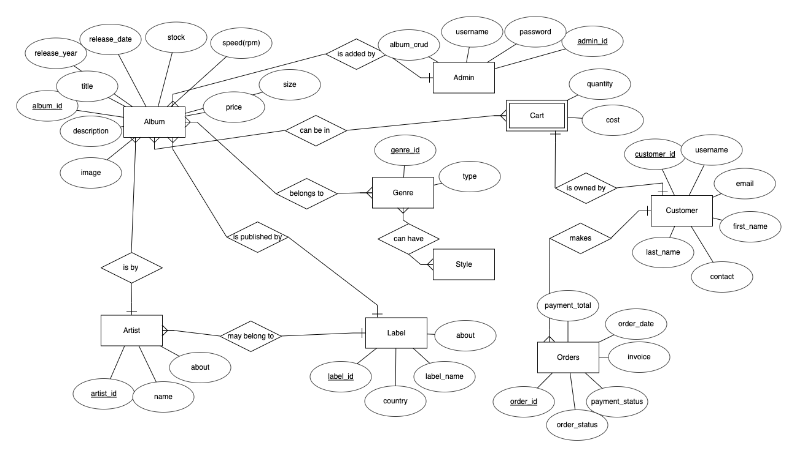

# The Vinyl Jukebox - Business Owner 

This is the backend admin page for e-commerce site **The Vinyl Jukebox**. Business owner is able to perform CRUD on products and track customer records and order information.
This app also hosts the API endpoints for the e-commerce site.

## Live Access 

Admin - https://illy-vinylshop.herokuapp.com/

#### Login Information

| Email | Password    |                
| :-------- | :------- | 
| `rotijohn@gemail.com` | `rotijohn123` |  

E-commerce - https://the-vinyl-jukebox.netlify.app/

Please note that heroku will take up to 30 seconds to load.

Full readme can be found at https://github.com/illydali/proj3-ecomm-react.

## Database Design
Usage of ORM libraries - db-migrate, Bookshelf, Knex 

- Database development done with MySQL in Gitpod. 
- Moved to Postgres after Heroku deployment. 

*One to many relationship*

Record to Artist

Record to Label

*Many to many relationship*

Record to Genres 

Cart to User and Record

Order to User and Record

#### Original design of the database before moving on to logical schema. 

## Technologies & Libraries Used
- NodeJS Framework
- Express 
- REST API
- Handlebars
- Bookshelf ORM
- Stripe
- Bootstrap 5
- Caolan Forms 
- Flash messages
- JSON Web Token 
- CORS
- CSRF
- Express-sessions and session-file-store
- moment.js

## Acknowlegements
